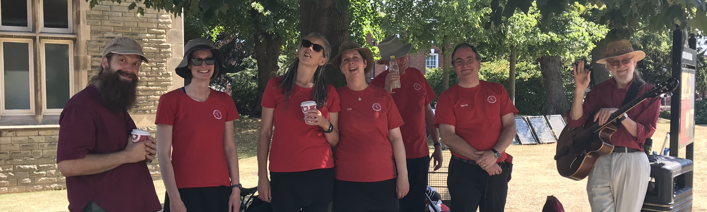

---
# New Dance Out!

## We will performing on Sunday at the Derby Folk Weekend outside the Bookcafe on Corn Market
---

Appalachian Dancing is an energetic and percussive form of dance that originated in the Appalachian Mountains of America and performed to Old-Time music.

Restless Soles are an Appalachian dance side formed in 2009 who regularly perform around Derbyshire.

You can find a list of [our up-coming dance outs here](shows.md):

Ordinarily we practice from 8pm to 9:30 pm on Monday nights at [The West End Community Centre (DE22 3BL)](https://wecc.org.uk/) on Mackworth Road.

You can listen or play along to some of our [music here](music.html)

Or follow us on social media:
<!---

--->

<!---
<a class="twitter-timeline"
  href="https://twitter.com/Restless_soles">
Tweets by @restless_soles
</a>
--->
