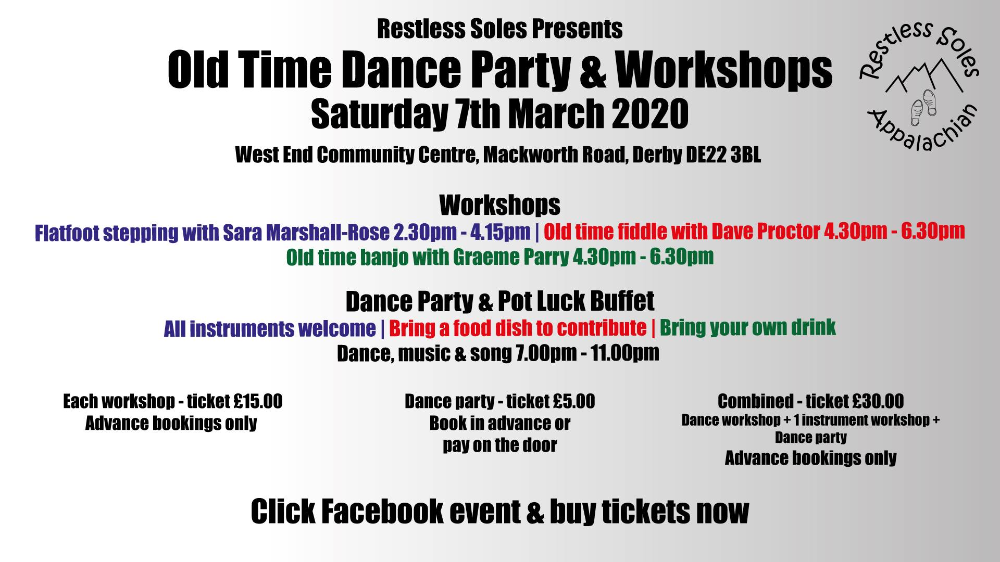

Appalachian Dancing is an energetic and percussive form of dance that originated in the Appalachian Mountains of America and performed to Old-Time music.

Restless Soles are an Appalchian dance side formed in 2014 who regularly perform around Derbyshire.

Ordinarily we practice from 8pm to 10pm on Monday nights at [Little Eaton Village Hall (DE21 5EA)](https://www.littleeatonparishcouncil.org.uk/little-eaton-village-hall.html)

However, due to restrictions because of Coronavirus we are attempting to practice virtually using Zoom - with hilarious results.
<!---
Event! - We are hosting an Old-Time Dance party and music workshops:

--->

You can listen or play along to some of our [music here](music.html)

Or follow us on social media:
<!---

--->

<!---
<a class="twitter-timeline"
  href="https://twitter.com/Restless_soles">
Tweets by @restless_soles
</a>
--->
